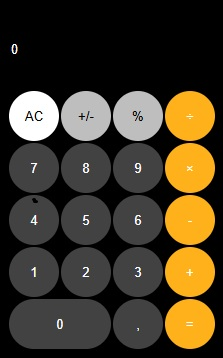

# 🧮 Calculadora

Este é um projeto de **calculadora simples** desenvolvido com **HTML, CSS e JavaScript**, inspirado no design da calculadora do meu celular. Foi criado com o objetivo de praticar conceitos fundamentais de **lógica de programação**, manipulação do **DOM** e organização do código com **eventos** e **funções reutilizáveis**.

## 💡 Funcionalidades

- Operações básicas: adição, subtração, multiplicação e divisão
- Interface intuitiva e responsiva
- Atualização dinâmica do display
- Estilização com CSS personalizado

## 🛠️ Tecnologias utilizadas

- HTML5
- CSS3
- JavaScript

## 🎯 Objetivo do projeto

Este projeto foi desenvolvido para consolidar o aprendizado em:
- Estruturas de decisão e controle
- Manipulação de eventos com JavaScript
- Interação com o DOM
- Organização de código em funções

## 📸 Prévia

## 🔗 Acesse o projeto

Você pode ver o código-fonte completo aqui no GitHub ou abrir diretamente no navegador com o GitHub Pages:  
👉 https://EUMIRIAM.github.io/calculadora

---

Feito com 💻 por **Miriam**
